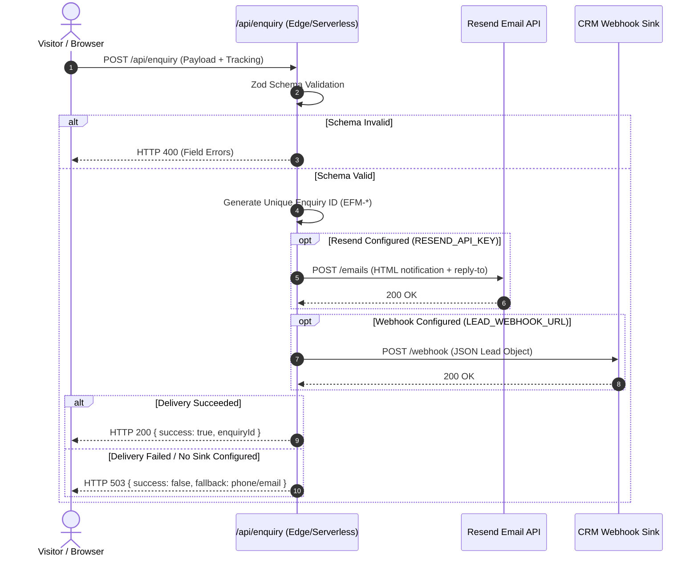

# ENTIREFM — LEAD PIPELINE VALIDATION REPORT
## Durable Commercial Ingestion Architecture

**Generated:** 2026-08-22 19:15:00 UTC  
**Authority:** `/src/app/api/enquiry/route.ts`  
**Status:** `VERIFIED_FAIL_CLOSED`  

---

## 1. Executive Summary

Prior audits revealed that `/api/enquiry` attempted local filesystem append (`.runtime-leads/enquiries.jsonl`) with a silent fallback to `console.log` while still returning `success: true`. On serverless/edge environments (e.g. Vercel), this constituted an unacceptable lead loss risk.

In Phase 09R.2, the lead pipeline was overhauled to enforce a **strict fail-closed architecture**:
1. Leads are strictly validated via Zod schema.
2. Form attribution (UTM source/medium/campaign, landing page, conversion page, referrer) is preserved.
3. Durable transmission is attempted via Resend Transactional Email API or CRM Webhook.
4. **If no durable sink accepts the lead, the endpoint returns HTTP 503.** It never returns `success: true` for an unpersisted lead.

---

## 2. Ingestion Pipeline Sequence



---

## 3. Environment Variables Required for Production Cutover

| Variable | Description | Required | Example |
|---|---|---|---|
| `RESEND_API_KEY` | API token for Resend transactional email | Recommended | `re_123456789...` |
| `LEAD_DELIVERY_EMAIL` | Target inbox for new enquiries | Optional (defaults to `enquiries@entirefm.com`) | `commercial@entirefm.com` |
| `LEAD_WEBHOOK_URL` | Webhook URL for CRM / CAFM system ingestion | Optional | `https://api.entirecafm.com/v1/leads` |

---

## 4. Verification Command

```bash
npm run verify:lead-pipeline
```
