# EntireFM — AI in Facilities Management Content Architecture

## 1. Executive Summary & Purpose
This document establishes the topical authority, internal linking structure, and governance model for the **AI in Facilities Management** Resource Centre and supporting knowledge cluster.

The objective is to position EntireFM as the premier UK facilities management partner combining real-world multi-skilled engineering delivery with modern CAFM software, intelligent automation, and transparent compliance management.

---

## 2. Cluster Topology & Internal Linking Graph

```mermaid
graph TD
  NAV[Navigation: Resources Mega Menu] --> PIL["Pillar: /resources/ai-in-facilities-management"]
  
  PIL --> S1["/resources/ai-in-facilities-management/predictive-maintenance"]
  PIL --> S2["/resources/ai-in-facilities-management/ai-helpdesk-work-orders"]
  PIL --> S3["/resources/ai-in-facilities-management/ai-cafm"]
  PIL --> S4["/resources/ai-in-facilities-management/energy-optimisation"]
  PIL --> S5["/resources/ai-in-facilities-management/digital-twins"]
  PIL --> S6["/resources/ai-in-facilities-management/ai-agents"]
  PIL --> S7["/resources/ai-in-facilities-management/computer-vision"]
  PIL --> S8["/resources/ai-in-facilities-management/ai-compliance"]
  PIL --> S9["/resources/ai-in-facilities-management/fm-data-readiness"]
  PIL --> S10["/resources/ai-in-facilities-management/ai-governance"]

  S1 --> SERV_PPM["/ppm (Commercial Planned Maintenance)"]
  S1 --> TOOL_PPM["/tools/ppm-schedule-builder (Matrix Tool)"]
  S1 --> BLOG_PPM["/post/predictive-maintenance-vs-ppm"]

  S2 --> SERV_HD["/helpdesk (24/7 Operations Desk)"]
  S2 --> BLOG_HD["/post/can-ai-run-an-fm-helpdesk"]

  S3 --> PORTAL["/client-login (EntireCAFM Portal)"]
  S3 --> BLOG_CAFM["/post/ai-and-the-future-of-cafm"]

  S4 --> SERV_HVAC["/hvac-contractor (HVAC Maintenance)"]
  S4 --> INTEL["/fm-intelligence (Market Intelligence)"]

  S5 --> WALK["/building-walk (Site Walkthroughs)"]
  S5 --> BLOG_DT["/post/digital-twins-in-facilities-management"]

  S6 --> BLOG_AGENT["/post/ai-agents-in-facilities-management"]
  S6 --> TOOL_TENDER["/tools/tender-brief (RFP Generator)"]

  S7 --> SERV_DRONE["/aerial-drone-building-inspection (Drone Surveys)"]

  S8 --> COMP["/compliance (Compliance Centre)"]
  S8 --> TOOL_CAL["/tools/compliance-calendar (Statutory Calendar)"]

  S9 --> VAULT["/resources/document-vault (CSV Templates)"]
  S9 --> BLOG_DATA["/post/asset-data-quality-for-fm-ai"]

  S10 --> BLOG_GOV["/post/10-questions-to-ask-ai-fm-software-suppliers"]
```

---

## 3. Comprehensive Content Mapping Matrix

| URL | Page Type | Primary Search Intent | Secondary Query Targets | Related Service | Related Tool | Related Blog Post |
|---|---|---|---|---|---|---|
| `/resources/ai-in-facilities-management` | **Pillar Page** | AI in facilities management | facilities management artificial intelligence, smart building AI | `/hard-services` | `/tools/ppm-schedule-builder` | `/post/ai-in-facilities-management-2026` |
| `/resources/ai-in-facilities-management/predictive-maintenance` | Sub-Guide | predictive maintenance facilities management | condition-based maintenance vs PPM, IoT vibration monitoring | `/ppm` | `/tools/ppm-schedule-builder` | `/post/predictive-maintenance-vs-ppm` |
| `/resources/ai-in-facilities-management/ai-helpdesk-work-orders` | Sub-Guide | AI FM helpdesk work orders | automated work order dispatch, CAFM ticket triage AI | `/helpdesk` | `/tools/fm-health-check` | `/post/can-ai-run-an-fm-helpdesk` |
| `/resources/ai-in-facilities-management/ai-cafm` | Sub-Guide | AI CAFM software | smart CAFM platforms, next generation CAFM | `/client-login` | `/tools/ppm-schedule-builder` | `/post/ai-and-the-future-of-cafm` |
| `/resources/ai-in-facilities-management/energy-optimisation` | Sub-Guide | AI commercial building energy optimisation | BMS energy AI, HVAC machine learning optimisation | `/hvac-contractor` | `/tools/fm-roi-calculator` | `/fm-intelligence` |
| `/resources/ai-in-facilities-management/digital-twins` | Sub-Guide | digital twins facilities management | BIM to CAFM integration, building digital twin reality | `/building-maintenance` | `/building-walk` | `/post/digital-twins-in-facilities-management` |
| `/resources/ai-in-facilities-management/ai-agents` | Sub-Guide | AI agents facilities management | agentic AI FM workflows, autonomous maintenance planning | `/hard-services` | `/tools/tender-brief` | `/post/ai-agents-in-facilities-management` |
| `/resources/ai-in-facilities-management/computer-vision` | Sub-Guide | computer vision facilities management | drone building inspection AI, thermal imaging defect detection | `/aerial-drone-building-inspection` | `/building-walk` | `/building-inspecting-testing` |
| `/resources/ai-in-facilities-management/ai-compliance` | Sub-Guide | AI statutory compliance facilities management | building safety certificate parsing, FM compliance audit | `/compliance` | `/tools/compliance-calendar` | `/compliance/fixed-wire-testing-eicr` |
| `/resources/ai-in-facilities-management/fm-data-readiness` | Sub-Guide | FM data readiness for AI | asset register data cleaning, AI readiness checklist FM | `/ppm` | `/resources/document-vault` | `/post/asset-data-quality-for-fm-ai` |
| `/resources/ai-in-facilities-management/ai-governance` | Sub-Guide | AI governance facilities management | smart building cybersecurity AI, AI vendor procurement questions | `/about-entire-facilities-management` | `/tools/tender-brief` | `/post/10-questions-to-ask-ai-fm-software-suppliers` |

---

## 4. Legal & Technical Compliance Safeguards

1. **Competent Person Retained**: Every compliance-related section explicitly clarifies that UK statutory certification (RRO 2005, EAWR 1989, ACOP L8, LOLER 1998) requires physical inspection and written sign-off by a certified human Competent Person.
2. **Transparent Commercial Claims**: General industry research trends are strictly separated from live EntireFM / EntireCAFM software capabilities.
3. **2026 Freshness Baseline**: All dates and technological discussions reflect 2026 operational standards without backdating.
