# EntireFM — Resources & Knowledge Ecosystem Architecture

## 1. Executive Summary & Purpose
The EntireFM Resources ecosystem serves as the definitive engineering, compliance, and maintenance planning hub for UK facilities managers, property directors, and managing agents.

This architecture establishes:
1. **Interactive FM Tools**: Practical calculators, diagnostic assessments, and procurement specification builders.
2. **Statutory Compliance Pathway**: Direct authoritative guidance linking technical legislation (RRO 2005, EAWR 1989, ACOP L8, LOLER 1998) to operational actions.
3. **Operational Learning & Templates**: Ungated CSV asset registers, logbooks, plain-English glossary definitions, and 2026 market intelligence.
4. **Permanent URL Preservation**: All 11 restored tools and resource hubs return HTTP 200, self-canonicalise, are listed in XML sitemaps, and are protected against redirect regression.

---

## 2. Information Architecture & Navigation Map

```mermaid
graph TD
  NAV[Primary Navigation: RESOURCES] --> C1[Column 1: FM TOOLS]
  NAV --> C2[Column 2: GUIDES & KNOWLEDGE]
  NAV --> C3[Column 3: COMPLIANCE & SAFETY]
  NAV --> C4[Column 4: FEATURED RESOURCE]

  C1 --> T1["/tools/fm-health-check (Diagnostic)"]
  C1 --> T2["/tools/ppm-schedule-builder (Asset Matrix)"]
  C1 --> T3["/tools/ppm-estimator (Budget Model)"]
  C1 --> T4["/tools/fm-roi-calculator (TCO Comparison)"]
  C1 --> T5["/tools/tender-brief (RFP Builder)"]
  C1 --> T6["/tools/compliance-calendar (12-Mo Planner)"]
  C1 --> T7["/tools (All Tools Directory)"]

  C2 --> K1["/resources (Unified Hub)"]
  C2 --> K2["/facilities-management-glossary (National A-Z)"]
  C2 --> K3["/fm-intelligence (2026 Market Analysis)"]
  C2 --> K4["/academy (Operational Curriculum)"]
  C2 --> K5["/resources/document-vault (Downloadable CSVs)"]
  C2 --> K6["/building-walk (Site Walkthroughs)"]
  C2 --> K7["/case-studies (Estate Profiles)"]

  C3 --> CP1["/compliance (Compliance Centre Hub)"]
  C3 --> CP2["/compliance/fire-risk-assessment (RRO 2005)"]
  C3 --> CP3["/compliance/fixed-wire-testing-eicr (BS 7671)"]
  C3 --> CP4["/compliance/emergency-lighting-testing (BS 5266)"]
  C3 --> CP5["/compliance/legionella-water-hygiene (ACOP L8)"]
  C3 --> CP6["/compliance/commercial-gas-safety (Reg 35)"]

  C4 --> FT["Featured: PPM Schedule Builder (/tools/ppm-schedule-builder)"]
```

---

## 3. Tool Classification & Standards Baseline

All tools and schedules strictly adhere to the **Compliance Centre** authority matrix:

| Classification | Definition | Governing Authority | Example Application |
|---|---|---|---|
| **LEGAL** | Explicit statutory requirement where law mandates frequency. | UK Acts & Regulations | Passenger Lift 6-Mo LOLER Exam, COSHH LEV 14-Mo Test |
| **STANDARD** | Recognized British Standard or HSE Approved Code of Practice. | BSI, HSE ACOP | BS 5266-1 Emergency Lighting 3-Hr Discharge, ACOP L8 Monthly Taps |
| **PRACTICE** | Recommended good engineering practice. | CIBSE Guides, BESA | Annual Boiler Combustion Service, AHU Filter Changes |
| **RISK** | Frequency determined by site-specific risk assessment. | Competent Person | Fixed Wire EICR (1 to 5 Year cycle based on environment) |

---

## 4. Technical Deliverables Summary

| Route Path | Component / Template | Features & Exports | SEO Status |
|---|---|---|---|
| `/resources` | `TemplateResourcesHub.tsx` | Live Search, Tools Grid, Compliance Gateway, Knowledge Cards | 200, Protected, Self-Canonical |
| `/tools` | `TemplateToolsHub.tsx` | Visual directory, Deliverables breakdown, Related services | 200, Protected, Self-Canonical |
| `/tools/fm-health-check` | `TemplateHealthCheck.tsx` | 7-system diagnostic, Progress bar, Gaps checklist, PDF Print | 200, Protected, Self-Canonical |
| `/tools/ppm-schedule-builder` | `TemplatePpmBuilder.tsx` | Asset selector, Search, Legal/Standard tags, CSV & Print export | 200, Protected, Self-Canonical |
| `/tools/compliance-calendar` | `TemplateComplianceCalendar.tsx` | 12-month selector, Duty holder references, .ICS export, Print | 200, Protected, Self-Canonical |
| `/tools/ppm-estimator` | `TemplatePpmEstimator.tsx` | Sector & sq ft sliders, Scope toggle, Cost per sq ft, Print | 200, Protected, Self-Canonical |
| `/tools/fm-roi-calculator` | `TemplateRoiCalculator.tsx` | TCO comparison model, Reactive vs Planned, Hours saved, Print | 200, Protected, Self-Canonical |
| `/tools/tender-brief` | `TemplateTenderBrief.tsx` | Step-by-step RFP form, Markdown copy, .MD download, Print | 200, Protected, Self-Canonical |
| `/fm-intelligence` | `TemplateFmIntelligence.tsx` | 2026 Macro indicators, Sourced regulatory briefings | 200, Protected, Self-Canonical |
| `/academy` | `TemplateAcademy.tsx` | 4 Operational modules, Key learning points, Tool pathways | 200, Protected, Self-Canonical |
| `/resources/document-vault` | `TemplateDocumentVault.tsx` | Ungated dynamic CSV & Markdown downloads | 200, Protected, Self-Canonical |
| `/building-walk` | `TemplateBuildingWalk.tsx` | Plantroom & building inspection guides, Checkpoints & defects | 200, Protected, Self-Canonical |
