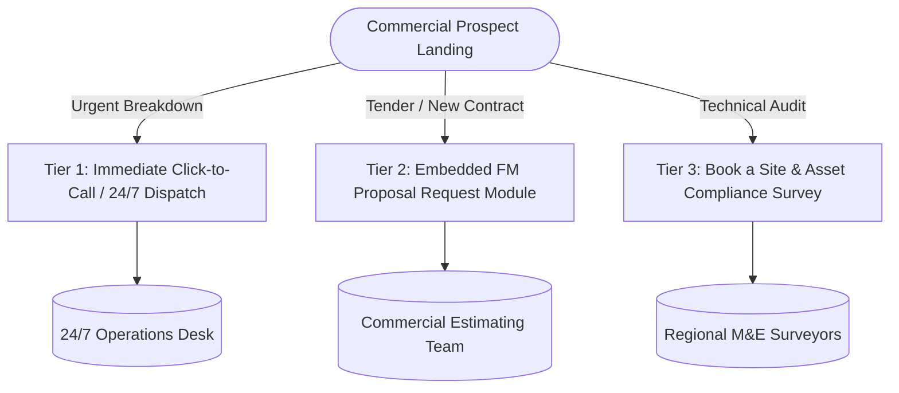

# EntireFM Conversion Architecture

> **Document:** `/docs/seo-rebuild/CONVERSION-ARCHITECTURE.md`  
> **Phase:** 02H — Lead Generation, Commercial Funnels & Regional Call Routing  
> **Fundamental Principle:** **Every commercial page must provide an embedded conversion engine. Do NOT rely solely on linking out to a generic `/contact` page.**

---

## 1. Multi-Tier Conversion Funnel Design



---

## 2. Page-Specific Conversion Patterns

### A. Homepage Conversion
* **Primary Hero CTA:** `Request an FM Proposal` (Triggers smooth scroll to embedded quote engine).
* **Secondary Hero CTA:** `Book a Site Survey` / `Call 24/7 Helpdesk [VERIFIED NATIONAL PHONE]`.
* **Mid-Page Tool:** Interactive `PPM ROI & Compliance Calculator` capturing email + phone for detailed breakdown.
* **Sticky Header CTA:** Direct Phone Call + `Get a Quote` button.

### B. Hard FM & Technical Pages (`/mechanical-electrical`, `/hvac-contractor`, `/ppm`)
* **Primary In-Page CTA:** Embedded "Technical Maintenance Enquiry" Form.
* **Form Fields:**
  1. Facility Type (Commercial Office, Industrial, Warehouse, Residential Block, Retail).
  2. Scope Needed (M&E, HVAC, SFG20 PPM, Electrical EICR, Gas Boiler Plant).
  3. Approximate Number of Sites / Square Footage.
  4. Postcode / Region.
  5. Full Name, Business Email & Contact Phone Number.
* **Secondary Direct Contact:** "Speak with a Senior M&E Estimator" with regional phone click-to-call.

### C. Tier 1 Location Pages (`/facilities-management-london`, `/fm-manchester`, etc.)
* **Primary In-Page CTA:** Localized "Request a [City] FM Proposal" module.
* **Localized Phone Numbers:**
  * London: `[VERIFIED LONDON TELEPHONE]`
  * Midlands / Chesterfield HQ: `[VERIFIED CHESTERFIELD TELEPHONE]`
  * Manchester / North West: `[VERIFIED MANCHESTER TELEPHONE]`
  * National 24/7 Emergency Line: `[VERIFIED NATIONAL 24/7 TELEPHONE]`
* **Local Response Callout:** "Local mobile engineering fleet active across [City] — typical emergency response within 2 hours."

### D. Sector Pages (`/industrial-facilities-management`, `/commercial-facilities-management`)
* **Primary CTA:** "Request a Sector-Specific Facility Audit".
* **Lead Magnet:** "Download the [Sector] Statutory Compliance & Maintenance Checklist".

---

## 3. High-Conversion Embedded Form Blueprint

```html
<!-- High-Intent Commercial Form Structure -->
<form class="entirefm-commercial-quote-engine">
  <h3>Request a Tailored FM Proposal</h3>
  <p>Direct response from our commercial estimating team within 2 working hours.</p>
  
  <div class="form-grid">
    <div class="field">
      <label>Service Category</label>
      <select name="service_required" required>
        <option>Integrated Facilities Management (Total FM)</option>
        <option>Mechanical & Electrical (Hard FM)</option>
        <option>Commercial HVAC & Ventilation</option>
        <option>Planned Preventative Maintenance (SFG20 PPM)</option>
        <option>Industrial & Specialist Cleaning</option>
        <option>Commercial Contract Cleaning</option>
        <option>24/7 Reactive Maintenance Only</option>
      </select>
    </div>
    
    <div class="field">
      <label>Primary Property Sector</label>
      <select name="property_sector" required>
        <option>Commercial Office / Corporate HQ</option>
        <option>Industrial Plant / Manufacturing</option>
        <option>Logistics / Warehousing</option>
        <option>Residential Block / Managing Agent</option>
        <option>Retail Park / Shopping Centre</option>
        <option>Hotel / Hospitality / Leisure</option>
        <option>Education / Healthcare</option>
        <option>Other Commercial Estate</option>
      </select>
    </div>

    <div class="field">
      <label>Primary Site Postcode / Location</label>
      <input type="text" name="location" placeholder="e.g. EC2A 2BB, M1 1AD, S41 9QG" required />
    </div>

    <div class="field">
      <label>Number of Sites</label>
      <select name="site_count">
        <option>Single Site</option>
        <option>2 - 5 Regional Sites</option>
        <option>6 - 20 Multi-Site Portfolio</option>
        <option>20+ National Estate</option>
      </select>
    </div>

    <div class="field">
      <label>Your Name & Job Title</label>
      <input type="text" name="contact_name" placeholder="e.g. John Smith, Operations Director" required />
    </div>

    <div class="field">
      <label>Work Email Address</label>
      <input type="email" name="work_email" placeholder="name@company.co.uk" required />
    </div>

    <div class="field">
      <label>Direct Contact Phone</label>
      <input type="tel" name="phone_number" placeholder="07... or 01..." required />
    </div>
  </div>

  <button type="submit" class="cta-button primary">Generate My Commercial Proposal</button>
  <span class="privacy-note">🔒 Zero spam. Strictly commercial enquiries. Fully GDPR compliant.</span>
</form>
```
