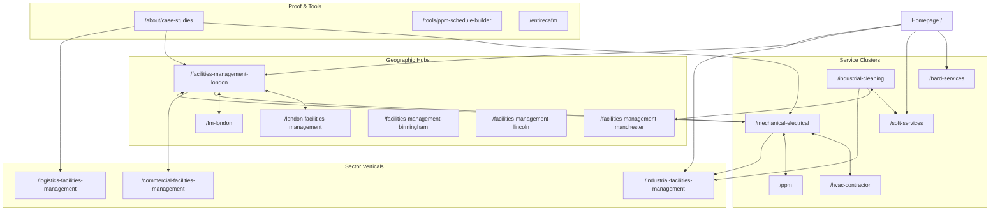

# EntireFM Final Internal Linking Blueprint

> **Document:** `/docs/seo-rebuild/FINAL-INTERNAL-LINKING-BLUEPRINT.md`  
> **Phase:** 02K — Authority Graph & Contextual PageRank Distribution  
> **Fundamental Principle:** **The website operates as an interconnected authority graph. Eliminate orphan pages and establish strict topical clusters.**

---

## 1. The Global Authority Graph Model

---

## 2. Mandatory Cross-Linking Rules

1. **Service Pages MUST Link To:**
   * Related sibling services (e.g., `/mechanical-electrical` must contextually link to `/hvac-contractor` and `/ppm`).
   * Primary sectors utilizing the service (e.g., `/mechanical-electrical` links to `/commercial-facilities-management` and `/industrial-facilities-management`).
   * Primary Tier 1 locations (e.g., "Delivering M&E services across [London](/facilities-management-london), [Manchester](/facilities-management-manchester), and [the Midlands](/facilities-management-in-the-midlands)").
   * Relevant case studies.

2. **Location Pages MUST Link To:**
   * Core Hard & Soft FM service landing pages using exact keyword anchors.
   * Differentiated sibling pages in the same city (e.g., `/facilities-management-london` links to `/london-facilities-management` and `/fm-london`).
   * Relevant regional case studies.
   * Neighboring geographic hubs (e.g., `/fm-sheffield` links to `/facilities-management-chesterfield` and `/facilities-management-in-the-midlands`).

3. **Sector Pages MUST Link To:**
   * The core service bundle for that vertical (e.g., `/logistics-facilities-management` links to `/industrial-cleaning`, `/ppm`, `/hard-services`).
   * Case studies in that sector.
   * Primary geographic distribution corridors.

4. **Case Studies MUST Form a Complete Triplet:**
   * Explicit contextual link to the featured Service page.
   * Explicit contextual link to the featured Sector page.
   * Explicit contextual link to the featured Location page.

---

## 3. High-Priority London Authority Funnel

To ensure London landing pages rapidly regain top-3 rankings, they receive maximum internal PageRank support:
* **Homepage:** Dedicated London feature card linking to `/facilities-management-london` and `/fm-london`.
* **Services:** Every Hard and Soft FM service page includes a dedicated "Greater London Delivery" block linking to `/facilities-management-london`.
* **Sectors:** Commercial, Corporate, and Residential sector pages link to `/london-facilities-management`.
* **Footer:** Deliberate, curated link to the primary London hub.
