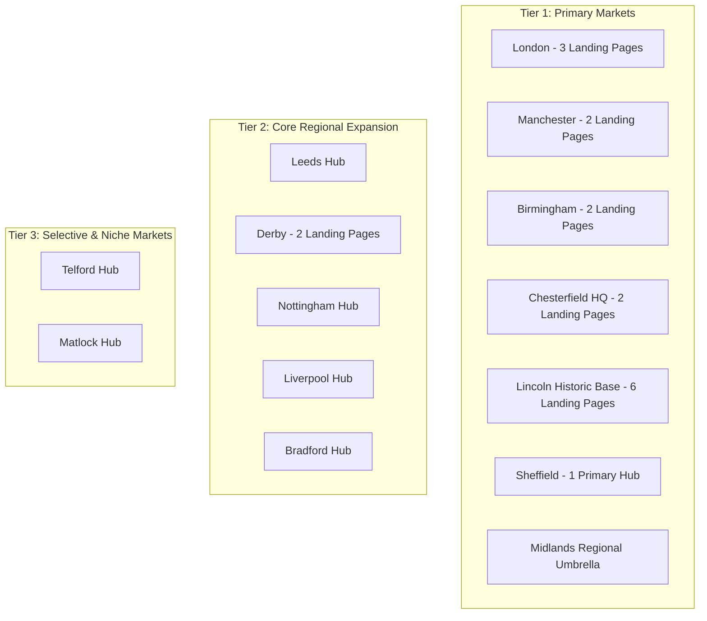

# EntireFM Final Location Architecture

> **Document:** `/docs/seo-rebuild/FINAL-LOCATION-ARCHITECTURE.md`  
> **Phase:** 02C — Geographic Strategy & Multi-Page Market Ownership  
> **Fundamental Principle:** **Do NOT collapse cities to a single URL.** Multiple pages targeting the same metropolitan area are preserved and differentiated by distinct commercial search intents.

---

## 1. Geographic Market Tiering



---

## 2. London — Tier 1 Flagship Market (3 Approved Landing Pages)

London generated significant traffic and high-value corporate contract enquiries in G1 and G2. We explicitly retain **three distinct landing pages** serving different commercial search intents.

```
LONDON MARKET ARCHITECTURE
│
├── Page 1: /facilities-management-london (Comprehensive Integrated FM & Estate Management)
│
├── Page 2: /london-facilities-management (Corporate Procurement, Tier-One & Multi-Site Contractors)
│
└── Page 3: /fm-london (Rapid Response, 24/7 Hard FM, M&E & Critical Breakdown Service)
```

### London Page 1: `/facilities-management-london`
* **Historic URL:** `/facilities-management-london` (G1, G2)
* **Exact Primary Search Intent:** "facilities management London", "FM services Greater London"
* **Target Audience:** Estate Directors, Property Managers, and Operations Directors managing mixed commercial, luxury residential blocks, and retail estates across Greater London.
* **Core Value Proposition:** Full-scope Integrated Facilities Management (Total FM) combining M&E statutory compliance, SFG20 PPM, high-end front-of-house concierge, security, and reactive property care.
* **Key Sections:**
  1. Greater London Estate Management Capabilities (Zone 1 to M25 coverage).
  2. Integrated Service Delivery Matrix (Hard FM + Soft Services + Statutory Compliance).
  3. London Access, Permitting & Emission Zone Compliance (ULEZ compliant fleet, out-of-hours delivery protocols).
  4. Interactive CAFM Dashboard showcase (`EntireCAFM` live asset tracking).
  5. Verified Client Proof & Accreditations (SafeContractor, BESA, Gas Safe, ISO 9001).
* **Conversion Mechanism:** Direct "Request London FM Proposal" + "Book London Site Audit" modal.
* **Schema:** `ProfessionalService` & `LocalBusiness` with `areaServed: "Greater London"`.

### London Page 2: `/london-facilities-management`
* **Historic URL:** `/london-facilities-management` (G1, G2)
* **Exact Primary Search Intent:** "facilities management company London", "London FM contractors", "corporate facilities management London"
* **Target Audience:** Corporate Procurement Heads, Managing Agents, Facility Directors seeking an accredited, multi-site tier-one FM partner for corporate HQs in the City, Canary Wharf, Mayfair, and West End.
* **Core Value Proposition:** Enterprise-grade FM governance, ESG-aligned building operations, supplier consolidation, and commercial contract cost-optimisation.
* **Key Sections:**
  1. Corporate Governance & Procurement Standards (transparent KPI reporting, SLA guarantees).
  2. Multi-Site Portfolio Management (City of London, Canary Wharf, Midtown, West End).
  3. Hard FM Compliance Auditing & Risk Mitigation.
  4. ESG, Energy Reduction & Sustainable Building Initiatives.
* **Conversion Mechanism:** "Download Corporate FM Scope" / "Request Procurement Tender Meeting".
* **Schema:** `Organization` + `LocalBusiness`.

### London Page 3: `/fm-london`
* **Historic URL:** `/fm-london` (G1, G2, G3 live)
* **Exact Primary Search Intent:** "FM London", "rapid response FM London", "emergency M&E engineers London", "24/7 building maintenance London"
* **Target Audience:** Building Managers, Facilities Supervisors facing urgent mechanical/electrical breakdowns, HVAC failures, or requiring immediate emergency engineer dispatch.
* **Core Value Proposition:** 2-hour emergency response SLA across Central London, 24/7/365 manned helpdesk, local mobile engineering vans on call.
* **Key Sections:**
  1. Emergency 24/7 Breakdown & Call-Out Protocol.
  2. Mobile Engineering Fleet Dispatch (HVAC, Gas, Electrical, Plumbing, Access Control).
  3. Reactive Plant Room Repairs & Statutory Recovery.
* **Conversion Mechanism:** Click-to-Call Emergency Helpdesk `[VERIFIED LONDON 24/7 NUMBER]` + "Immediate Dispatch Request Form".
* **Schema:** `EmergencyService` & `LocalBusiness`.

---

## 3. Manchester — Tier 1 Market (2 Approved Landing Pages)

```
MANCHESTER MARKET ARCHITECTURE
│
├── Page 1: /facilities-management-manchester (Primary Commercial & Industrial FM Hub)
└── Page 2: /fm-manchester (Rapid Maintenance & Reactive M&E Dispatch)
```

### Manchester Page 1: `/facilities-management-manchester`
* **Historic URL:** `/facilities-management-manchester` (G1, G2)
* **Intent:** "facilities management Manchester", "FM company Manchester", "commercial property maintenance Greater Manchester"
* **Audience:** Logistics hub managers (Trafford Park, Salford Quays), Manchester city center commercial offices, manufacturing plants.
* **Proposition:** Comprehensive Hard & Soft FM across Greater Manchester, Cheshire, and Lancashire.
* **Features:** Industrial cleaning integration, HVAC plant maintenance, CAFM real-time compliance reporting.

### Manchester Page 2: `/fm-manchester`
* **Historic URL:** `/fm-manchester` (G1, G2, G3)
* **Intent:** "fm manchester", "commercial property repairs Manchester", "emergency maintenance Manchester"
* **Audience:** Facilities supervisors requiring reactive engineering and planned maintenance execution.
* **Proposition:** Mobile M&E maintenance engineers, 24/7 helpdesk dispatch, reactive fabric repairs.

---

## 4. Birmingham & West Midlands — Tier 1 Market (2 Approved Landing Pages)

```
BIRMINGHAM MARKET ARCHITECTURE
│
├── Page 1: /facilities-management-birmingham (Primary West Midlands Commercial & Logistics Hub)
└── Page 2: /fm-birmingham (Rapid Engineering & Reactive Property Services)
```

### Birmingham Page 1: `/facilities-management-birmingham`
* **Historic URL:** `/facilities-management-birmingham` (G1, G2)
* **Intent:** "facilities management Birmingham", "FM company Birmingham", "West Midlands facilities management"
* **Audience:** Birmingham city core corporate towers, Solihull commercial parks, Black Country industrial estates.
* **Proposition:** Full-scope regional facilities management, heavy industrial cleaning, statutory compliance.

### Birmingham Page 2: `/fm-birmingham`
* **Historic URL:** `/fm-birmingham` (G1, G2, G3)
* **Intent:** "fm birmingham", "Birmingham property maintenance", "emergency plant maintenance Birmingham"
* **Proposition:** Rapid reactive engineering, HVAC/boiler breakdowns, 24/7 mobile dispatch.

---

## 5. Lincoln — Tier 1 Major Historic Stronghold (6 Approved Landing Pages)

Lincoln was EntireFM's original operational heartland with extensive indexed page history across multiple commercial sectors. We restore this complete ecosystem.

```
LINCOLN MARKET ECOSYSTEM
│
├── 1. /facilities-management-lincoln (Primary Regional Hub)
├── 2. /fm-lincoln (Operational & Reactive Dispatch)
├── 3. /commercial-fm-lincoln (Office & Corporate FM)
├── 4. /industrial-fm-lincoln (Factory, Agricultural & Industrial Plant FM)
├── 5. /residential-fm-lincoln (Block Management & Residential Estates)
└── 6. /retail-fm-lincoln (High Street & Retail Park Facilities Management)
```

* **`/facilities-management-lincoln`:** Primary regional anchor serving Lincolnshire, Newark, and surrounding commercial districts.
* **`/fm-lincoln`:** Fast-loading mobile maintenance hub with direct phone CTAs for local businesses.
* **`/commercial-fm-lincoln`:** Corporate office cleaning, HVAC maintenance, compliance auditing for business parks.
* **`/industrial-fm-lincoln`:** Heavy manufacturing, food processing facilities, agricultural logistics, factory deep cleaning, and machinery maintenance.
* **`/residential-fm-lincoln`:** Leasehold block maintenance, communal cleaning, grounds upkeep, fire door inspections for Lincoln managing agents.
* **`/retail-fm-lincoln`:** Shopping centres, out-of-town retail parks, reactive shutter repairs, car park management.

---

## 6. Chesterfield & Headquarters Base (2 Approved Landing Pages)

```
CHESTERFIELD HQ ARCHITECTURE
│
├── Page 1: /facilities-management-chesterfield (Headquarters Commercial FM Hub)
└── Page 2: /fm-chesterfield (Local Engineering Fleet Dispatch)
```

* **`/facilities-management-chesterfield`:** Primary home-base authority page. Highlights local headquarters, rapid Derbyshire response, national management control center.
* **`/fm-chesterfield`:** Fast-response local contractor page for Derbyshire commercial premises and industrial estates.

---

## 7. Sheffield, Derby, Leeds, Liverpool, Bradford & Nottingham

* **`/fm-sheffield`:** Tier 1 Major Hub serving South Yorkshire steel/manufacturing corridor and Sheffield commercial centre.
* **`/facilities-management-derby` & `/fm-derby`:** Tier 1 Dual pages serving Derby's aerospace, automotive, and railway manufacturing supply chain.
* **`/fm-leeds`:** Tier 2 Yorkshire commercial and financial services hub.
* **`/fm-nottingham`:** Tier 2 East Midlands logistics and commercial hub.
* **`/fm-liverpool`:** Tier 2 Maritime, warehousing, and commercial property hub.
* **`/facilities-management-bradford` & `/fm-bradford`:** Tier 2 Dual pages targeting West Yorkshire manufacturing and logistics.

---

## 8. Regional Umbrella Hubs

* **`/facilities-management-in-the-midlands`:** Preserves the core G1+G2 regional authority umbrella connecting Birmingham, Derby, Nottingham, and Lincoln operations.
* **Future Northern Hub Opportunity (P3):** Plan `/facilities-management-northern-powerhouse` as an expansion umbrella.
