# EntireFM Final Sector Architecture

> **Document:** `/docs/seo-rebuild/FINAL-SECTOR-ARCHITECTURE.md`  
> **Phase:** 02E — Commercial Vertical Specialisation & Authority  
> **Fundamental Principle:** **Serve genuine commercial buyers with sector-specific operational problem solving.**

---

## 1. Commercial Sector Hierarchy Overview

```mermaid
graph TD
    Sectors[EntireFM Commercial Sector Portfolio]
    
    subgraph Heavy & Industrial
        Ind["/industrial-facilities-management (Manufacturing & Heavy Plants)"]
        Log["/logistics-facilities-management (Warehousing & 3PL Hubs)"]
        Trans["/transport-facilities-management (Aviation, Rail & Transport)"]
        Cons["/construction-facilities-management (Site Setup & Handover)"]
    end
    
    subgraph Corporate & Commercial
        Comm["/commercial-facilities-management (Corporate Offices & HQs)"]
        Prop["/property-manager-fm-services (Managing Agents & Landlords)"]
        TierOne["/tier-one-facilities-management (Enterprise & Tier-1 Estates)"]
        Landmark["/landmark-facilities-management (Heritage & Landmark Sites)"]
    end
    
    subgraph Public & Consumer
        Resi["/residential-facilities-management (Block Management & BTR)"]
        Ret["/retail-facilities-management (Shopping Centres & Retail Parks)"]
        Hot["/hotel-facilities-management (Hotels, Resorts & Leisure)"]
        Health["/healthcare-facilities-management (Clinics & Medical Facilities)"]
        Edu["/education-facilities-management (Schools, Colleges & Academies)"]
        Arena["/arena-facilities-management (Stadiums, Arenas & Venues)"]
        ServiceSt["/service-station-fm (Forecourts & EV Hubs)"]
    end
    
    Sectors --> Ind
    Sectors --> Comm
    Sectors --> Resi
```

---

## 2. Sector Specifications & Buyer Intent

### 1. Industrial & Manufacturing Facilities Management
* **Final Approved URL:** `/industrial-facilities-management` (Restored clean historic URL)
* **Target Buyer:** Plant Managers, Operations Directors, Health & Safety Executives.
* **Key Operational Challenges:** Machine downtime prevention, heavy factory degreasing, high-voltage electrical distribution, ATEX compliance, environmental discharge standards.
* **Core Services Highlighted:** Heavy M&E servicing, industrial cleaning, PPM, 24/7 reactive plant repair, compressed air systems.

### 2. Logistics & Warehouse Facilities Management
* **Final Approved URL:** `/logistics-facilities-management` (Secondary alias `/warehouse-facilities-management` -> 301)
* **Target Buyer:** Distribution Centre Managers, 3PL Operations Directors.
* **Key Challenges:** 24/7 continuous operation, dock leveller and roller shutter maintenance, high-bay lighting, massive floor scrubbing, yard drainage.

### 3. Commercial Offices & Corporate Facilities Management
* **Final Approved URL:** `/commercial-facilities-management`
* **Target Buyer:** Corporate Real Estate Directors, Workplace Managers.
* **Key Challenges:** Tenant comfort (HVAC & IAQ), statutory compliance (fire, emergency lighting, legionella), premium front-of-house concierge, energy efficiency / ESG reporting.

### 4. Residential Block & Estate Facilities Management
* **Final Approved URL:** `/residential-facilities-management`
* **Target Buyer:** Residential Managing Agents, Build-to-Rent (BTR) Operators, RMC Directors.
* **Key Challenges:** Building Safety Act 2022 compliance, communal M&E maintenance, lift servicing oversight, 24/7 resident emergency helpdesk, grounds maintenance.

### 5. Retail & Shopping Centre Facilities Management
* **Final Approved URL:** `/retail-facilities-management`
* **Target Buyer:** Shopping Centre Managers, Retail Park Asset Managers, High-Street Multi-Site Operations.
* **Key Challenges:** High footfall cleanliness, customer safety, rapid out-of-hours reactive repairs, entrance barrier maintenance, car park management.

### 6. Hotel, Hospitality & Leisure Facilities Management
* **Final Approved URL:** `/hotel-facilities-management` (Secondary `/restaurant-facilities-management` -> 301)
* **Target Buyer:** General Managers, Estate Engineers for hotel chains and luxury resorts.
* **Key Challenges:** 24/7 guest satisfaction, zero HVAC/hot water interruption, kitchen extraction compliance (TR19), pool plant & leisure maintenance.

### 7. Managing Agent & Landlord FM Services
* **Final Approved URL:** `/property-manager-fm-services`
* **Target Buyer:** Commercial Property Managers, Chartered Surveyors (RICS).
* **Key Challenges:** Single-point accountability across multi-tenant commercial portfolios, transparent service charge expenditure, automated CAFM reporting.

### 8. Education & Schools Facilities Management
* **Final Approved URL:** `/education-facilities-management`
* **Target Buyer:** Multi-Academy Trust (MAT) Estate Directors, Bursars, School Business Managers.
* **Key Challenges:** Enhanced DBS-checked engineering staff, holiday deep cleaning and refurbishment, statutory compliance audits (Condition Improvement Fund support).

### 9. Healthcare & Medical Facilities Management
* **Final Approved URL:** `/healthcare-facilities-management`
* **Target Buyer:** Practice Managers, Private Hospital Estate Managers, Clinic Operators.
* **Key Challenges:** Clinical hygiene standards, infection control, backup generator testing, clinical waste management, HTM compliance.

### 10. Transport, Aviation & Infrastructure FM
* **Final Approved URL:** `/transport-facilities-management` (Alias `/airport-facilities-management` -> 301)
* **Target Buyer:** Airport Operations Managers, Rail Depot Directors, Fleet Transit Centers.
* **Key Challenges:** Airside/landside security clearance, high-intensity public safety, terminal cleaning, heavy plant maintenance.

### 11. Arena, Stadium & Event Venues FM
* **Final Approved URL:** `/arena-facilities-management`
* **Target Buyer:** Venue Operations Directors, Stadium Safety Officers.
* **Key Challenges:** Rapid turnaround cleaning post-event, mass crowd safety barrier management, emergency lighting, floodlight maintenance.

### 12. Service Station & Forecourt FM
* **Final Approved URL:** `/service-station-fm`
* **Target Buyer:** Motorway Service Operators, Petrol Forecourt Networks, EV Charging Hub Operators.
* **Key Challenges:** Hazardous area compliance (DSEAR), forecourt interceptor drainage, high-pressure jet washing, canopy maintenance.

### 13. Construction Site Setup & Handover FM
* **Final Approved URL:** `/construction-facilities-management`
* **Target Buyer:** Main Contractors, Project Directors.
* **Key Challenges:** Temporary site power/plumbing, builders deep cleans, sparkle cleans prior to practical completion (PC).

### 14. Tier-One & Corporate Enterprise FM
* **Final Approved URL:** `/tier-one-facilities-management`
* **Target Buyer:** FTSE/Enterprise Procurement Directors seeking single-source Tier 1 FM contracting.

### 15. Landmark & Heritage Buildings FM
* **Final Approved URL:** `/landmark-facilities-management`
* **Target Buyer:** Conservation Trust Officers, Heritage Estate Custodians.
* **Key Challenges:** Non-invasive M&E maintenance, listed building compliance, specialist stone cleaning.
