> [!WARNING]
> **DEPRECATED — DO NOT USE FOR IMPLEMENTATION**  
> This document contains instructions that contradict the locked SEO architecture.  
> **AUTHORITATIVE SOURCE: /config/route-registry.json**  
> See: /docs/seo-rebuild/ARCHITECTURE-CONFLICT-AUDIT.md for details.

---

# EntireFM Final Service Architecture

> **Document:** `/docs/seo-rebuild/FINAL-SERVICE-ARCHITECTURE.md`  
> **Phase:** 02D — Service Hierarchy & Historic URL Restoration  
> **Fundamental Principle:** **Historic URL equity strictly overrides aesthetic cosmetic hierarchy.** Proven historic winners are restored to their exact historic root paths.

---

## 1. Service Ecosystem Hierarchy Overview

```mermaid
graph TD
    Services[EntireFM Service Ecosystem]
    
    subgraph Hard FM & Technical Engineering
        ME["/mechanical-electrical (M&E Services)"]
        HVAC["/hvac-contractor (HVAC & Ventilation)"]
        PPM["/ppm (Planned Preventative Maintenance)"]
        Hard["/hard-services (Hard FM Infrastructure)"]
        Plumb["/plumbing-gas (Commercial Plumbing & Gas Safe)"]
        Fire["/fire-emergency-systems (Fire & Safety Compliance)"]
        Building["/building-maintenance (Fabric Maintenance)"]
        Drone["/aerial-drone-building-inspection (Drone Surveys)"]
        Crane["/mobile-crane-hire (Mobile Crane & Specialist Lifting)"]
    end
    
    subgraph Soft FM & Environmental
        Soft["/soft-services (Soft Services Hub)"]
        IndClean["/industrial-cleaning (Heavy Industrial Cleaning)"]
        CommClean["/cleaning-services (Commercial Contract Cleaning)"]
        Sec["/security-services (Manned Guarding & Security)"]
        Grounds["/grounds-maintenance (Grounds & Landscaping)"]
        Concierge["/concierge-services (Front-of-House Concierge)"]
        Wash["/washroom-management (Washroom & Hygiene)"]
        Pressure["/pressure-washing (High-Pressure Jetting)"]
    end
    
    subgraph Operational Support
        Helpdesk["/24-7-fm-support (24/7 Reactive Helpdesk)"]
        CAFM["/entirecafm (CAFM Platform & Client Portal)"]
    end
    
    Services --> ME
    Services --> Soft
    Services --> Helpdesk
```

---

## 2. Hard FM & Technical Services (Restored Historic Winners)

### A. Mechanical & Electrical (M&E)
* **Final Approved URL:** `/mechanical-electrical` (Restored from G1/G2; replaces `/services/me-services`)
* **Redirect Alias:** `https://entirefm.com/services/me-services` -> 301 Redirect -> `/mechanical-electrical`
* **Search Intent:** "mechanical and electrical services", "M&E contractor", "commercial electrical contractor UK"
* **Technical Compliance Standards:** NICEIC Approved Contractor, 18th Edition BS 7671, CIBSE Guidelines, Gas Safe Register, F-Gas Certification.
* **Sub-Service Pages (Anchors or Child URLs):**
  * `/mechanical-electrical/access-control` (G2 preserved)
  * `/mechanical-electrical/emergency-light-testing` (G2 preserved)
* **Key Content Units:**
  * Power distribution, switchgear maintenance, and thermal imaging of electrical boards.
  * Commercial plant room overhauls, pumps, motors, and inverter drive servicing.
  * Interactive Asset Register Audit checklist.
* **Conversion Module:** "Book an M&E Compliance Survey" + Direct Call to Technical Desk.

### B. Commercial HVAC Contractor
* **Final Approved URL:** `/hvac-contractor` (Restored from G1/G2; NOT collapsed into generic M&E)
* **Search Intent:** "hvac contractor", "commercial hvac maintenance", "commercial air conditioning contractors UK"
* **Technical Compliance Standards:** REFCOM Elite, F-Gas Regulations (EC 517/2014), TM44 Air Conditioning Inspections, BESA DW/144 Ductwork specifications.
* **Key Content Units:**
  * VRF/VRV air conditioning servicing, chiller maintenance, AHU filter changes.
  * Commercial ventilation & extraction systems, heat recovery units.
  * Seasonal switchover servicing (summer cooling / winter heating prep).

### C. Planned Preventative Maintenance (PPM)
* **Final Approved URL:** `/ppm` (Restored from G1/G2; replaces `/services/ppm`)
* **Search Intent:** "planned preventative maintenance", "PPM facilities management", "SFG20 maintenance schedule"
* **Core Value Proposition:** SFG20 standard alignment, statutory compliance guarantee, asset lifecycle extension, reducing reactive repair overheads by up to 35%.
* **Integration:** Direct interactive embed of `/tools/ppm-schedule-builder`.

### D. Hard Services Umbrella Hub
* **Final Approved URL:** `/hard-services` (Restored from G1/G2)
* **Search Intent:** "hard facilities management", "hard fm services", "commercial building fabric maintenance"
* **Role:** Connects M&E, HVAC, Plumbing, Fire Systems, and Building Fabric into a cohesive single-contract solution.

### E. Commercial Plumbing & Gas Safe
* **Final Approved URL:** `/plumbing-gas` (Restored from G1/G2)
* **Search Intent:** "commercial plumbing services", "commercial gas safe engineers", "commercial boiler maintenance"
* **Technical Standards:** Gas Safe Registered, Water Regulations Advisory Scheme (WRAS), L8 ACoP Legionella Compliance.

### F. Fire, Safety Critical & Emergency Systems
* **Final Approved URL:** `/fire-emergency-systems` (Restored from G1; G2 `/safety-critical-emergency-systems` 301 redirects here)
* **Search Intent:** "fire emergency systems maintenance", "fire alarm testing FM", "safety critical building maintenance"
* **Technical Standards:** BS 5839 (Fire Alarms), BS 5266 (Emergency Lighting), Regulatory Reform (Fire Safety) Order 2005.

### G. Building Maintenance & Working at Heights
* **Final Approved URL:** `/building-maintenance` & `/working-at-heights`
* **Search Intent:** "commercial building maintenance", "building fabric repairs", "high-level building maintenance UK"
* **Technical Standards:** IPAF, PASMA, IRATA rope access, HSE Working at Height Regulations 2005.

### H. Aerial Drone Building Inspection
* **Final Approved URL:** `/aerial-drone-building-inspection`
* **Search Intent:** "aerial drone building inspection", "commercial roof drone survey UK", "thermal drone building audit"
* **Differentiator:** High-resolution 4K and thermal imaging of roofs, chimneys, and facades without costly scaffolding.

### I. Specialist Lifting & Mobile Crane Hire
* **Final Approved URL:** `/mobile-crane-hire`
* **Sub-Pages:** `/mobile-crane-hire/sheffield`, `/mobile-crane-hire/chesterfield`, `/mobile-crane-hire/truck-mount-crane-hire`, `/bocker-crane-hire`
* **Search Intent:** "mobile crane hire", "bocker crane hire UK", "contract crane lifting"

---

## 3. Soft FM & Environmental Services (Restored Historic Winners)

### A. Industrial Cleaning Specialist
* **Final Approved URL:** `/industrial-cleaning` (Restored from G1/G2)
* **Search Intent:** "industrial cleaning company UK", "factory cleaning services", "warehouse floor scrubbing & degreasing"
* **Key Content Units:** Heavy machinery degreasing, high-level structural cleaning, silo cleaning, post-industrial sanitization, COSHH compliance.
* **Geographic Matrix Connections:** Powers dynamic local routes (`/industrial-cleaning/sheffield`, `/industrial-cleaning/nottingham`, `/industrial-cleaning/manchester`, etc.).

### B. Commercial Contract Cleaning Hub
* **Final Approved URL:** `/cleaning-services` (Restored from G1; secondary winners `/contract-cleaning` & `/office-cleaning`)
* **Search Intent:** "commercial cleaning services", "contract cleaning company UK", "office cleaning contractors"
* **Key Content Units:** Daily office cleaning, communal area block cleaning, retail park sanitation, washroom replenishment.

### C. Security, Concierge, Grounds & Specialist Soft Services
* **`/security-services`:** SIA licensed manned guarding, mobile patrols, keyholding & alarm response.
* **`/concierge-services`:** Corporate front-of-house, residential concierge, visitor management.
* **`/grounds-maintenance` & `/landscaping`:** Commercial estate groundskeeping, tree surgery, winter gritting & snow clearance.
* **`/pressure-washing`:** Heavy-duty external surface restoration, car park jet washing, graffiti removal.
* **`/washroom-management`:** Sanitary bins, air care, water management, eco-replenishment.
* **`/carpark-management` & `/gates-barriers`:** Automatic barriers, ANPR integration, perimeter security.

---

## 4. Operational Support & Technology

* **`/24-7-fm-support`:** 24/7/365 emergency helpdesk, reactive engineer dispatch, nationwide call-out SLA.
* **`/entirecafm`:** Proprietary Computer-Aided Facilities Management portal, live asset tracking, digital work orders, compliance certificate vault.
