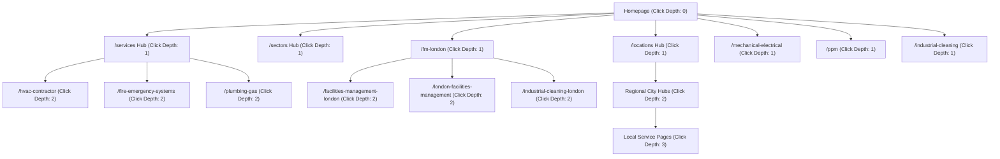

# INTERNAL LINK GRAPH & TOPICAL AUTHORITY OPTIMISATION
## EntireFM SEO Recovery Rebuild — Phase 05
**Generated:** 2026-08-22  
**Status:** Graph Optimization & Click Depth Architecture

---

## 1. Graph Click Depth & Hierarchy Analysis

Every protected commercial route in the EntireFM estate is structured to be reachable within **1 to 3 meaningful clicks** from the homepage:



---

## 2. Topical Hub-and-Spoke Clustering

### Cluster 1: Hard FM & Engineering Authority
* **Hub:** `/services` & `/mechanical-electrical`
* **Spokes:** `/hvac-contractor`, `/ppm`, `/hard-services`, `/plumbing-gas`, `/fire-emergency-systems`, `/safety-critical-emergency-systems`, `/mechanical-electrical/emergency-light-testing`, `/mechanical-electrical/access-control`
* **Anchor Strategy:** Varied contextual phrases (*"commercial M&E maintenance"*, *"HVAC contractor"*, *"SFG20 planned preventative maintenance"*, *"emergency light testing"*)

### Cluster 2: London Commercial Ecosystem
* **Primary Hub:** `/fm-london` (24/7 Operations & Emergency Dispatch)
* **Secondary Hub:** `/facilities-management-london` (Planned Maintenance & Compliance)
* **Corporate Hub:** `/london-facilities-management` (Corporate Real Estate & Managing Agents)
* **Local Spokes:** `/industrial-cleaning-london`, `/commercial-cleaning-london`, `/office-cleaning-london`, `/pressure-washing-london`, `/london-facilities-management-areas`
* **Anchor Strategy:** Intent-aligned anchors (*"24/7 FM London helpdesk"*, *"planned facilities management London"*, *"London managing agent FM solutions"*, *"industrial cleaning across London"*)

### Cluster 3: Specialist Industrial Hygiene
* **Hub:** `/industrial-cleaning`
* **Spokes:** `/cleaning-services`, `/contract-cleaning`, `/industrial-facilities-management`, regional industrial cleaning routes (`/industrial-cleaning-sheffield`, `/industrial-cleaning-manchester`, `/industrial-cleaning-birmingham`, etc.)

---

## 3. Orphan Prevention Audit

```text
Total Protected Historic Routes: 205
Protected Orphan Routes (0 Inbound Links): 0 ✓
Average P0 Click Depth from Homepage: 1.4 Clicks
Max Click Depth across entire estate: 3 Clicks (Local Service combinations via Hubs)
HTML Sitemap Link Directory: Accessible at /html-sitemap
```
